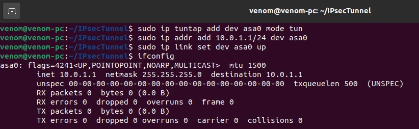
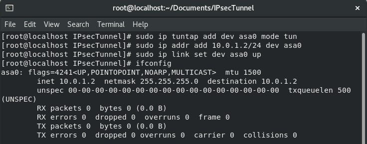
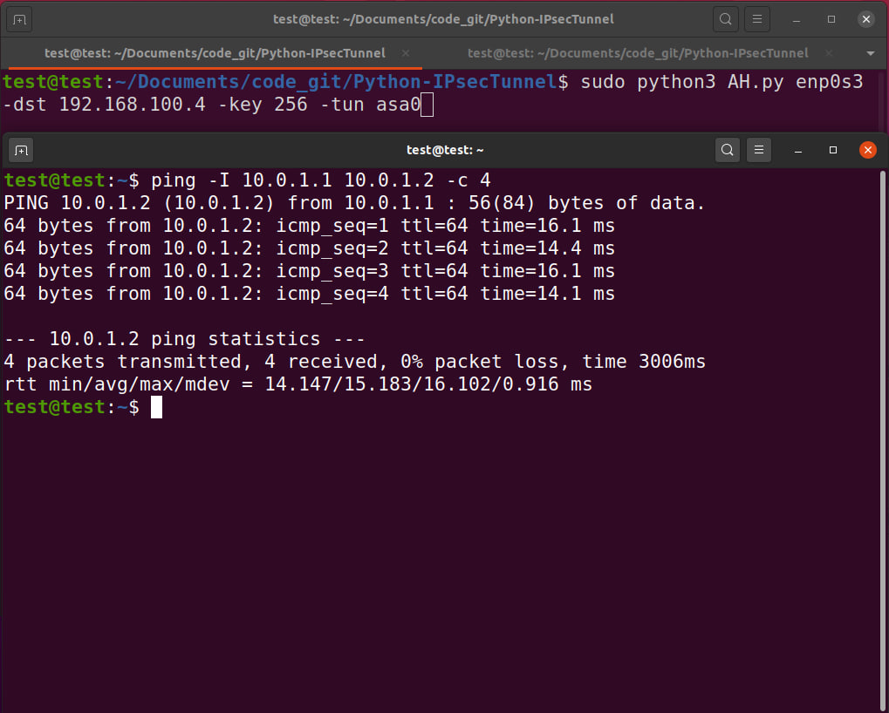
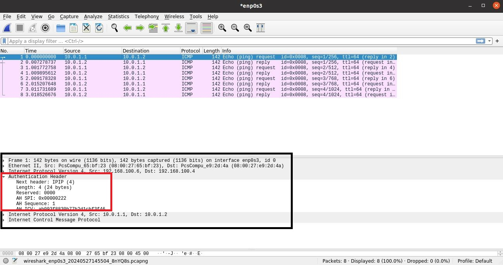

# Python IPsec AH Tunnel Mode

AH is used to authenticate — but not encrypt — IP traffic, serving three main purposes: verifying the identity of the communication partners, detecting any data alterations during transit, and optionally protecting against replay attacks where intercepted data is reintroduced into the network.

Authentication involves calculating a cryptographic hash-based message authentication code over most IP packet fields (excluding mutable ones like TTL or the header checksum). This code is then stored in an added AH header and sent to the recipient. The AH header, inserted between the original IP header and the payload, comprises five key fields as depicted in the below figure. 

Image source and further reading: [An Illustrated Guide to IPsec](http://www.unixwiz.net/techtips/iguide-ipsec.html "IPsec")


This project implements an Authentication Header (AH) tunnel mode between two hosts to ensure data integrity and source authentication. By using AH, the project provides a mechanism for authentication of the origin, checks the integrity of the transmitted data, and protects against replay attacks without encrypting the data payload. This implementation is crucial for environments where data confidentiality is less critical than the assurance of data origin and integrity.

Extra reading: https://blog.jadhusan.com/ipsec-tunneling/

# TUN interface

In the Ubuntu Machine 20.10, run following commands to setup a TUN interface called asa0.

1. ``sudo ip tuntap add dev asa0 mode tun``
2. ``sudo ip addr add 10.0.1.1/24 dev asa0``
3. ``sudo ip link set dev asa0 up``
4. ``ip addr show``



In the CentOs Machine , run following commands to setup a TUN interface called asa0.
1. ``sudo ip tuntap add dev asa0 mode tun``
2. ``sudo ip addr add 10.0.1.2/24 dev asa0``
3. ``sudo ip link set dev asa0 up``
4. ``ip addr show``



You can alternatively run the bash script on the designated machines:
1. On VM1 (Ubuntu): ``sudo bash setup_tun_vm1.sh``
2. On VM2 (CentOs): ``sudo bash setup_tun_vm2.sh``

# How this Tunnel works?

Basically, This Tunnel program runs in ubuntu box with two NIC interface, which one is assigned a static IP Address and other one is TUN interface that works as a virtual NIC. We have to excute the same file in both the machines to work. After excuting, we will send ICMP  request {ping} from Virtual NIC (asa0) on VM1 to VM2. Use the following command ``ping -I 10.0.1.1 10.0.1.2``. The Ping will send a ICMP request from vm1 to vm2 but the asa0 has no routing therefore ``AH.py`` will capture the traffic and calculate the ```icv``` value for the packet with current configuration defined in ``SecurityAssociation``. Then, script encapsulates the packet within new IP packet and send it to Physical NIC on VM2. When the packet arrives to VM2's physical NIC, the integrity verification is done and the packet will be written into it's Virtual NIC(asa0). Then VM2's Virtual NIC will send a ICMP reply to the request (ping) in the same manner. 

## EXAMPLE
Virtual Machines used for testing : </br>
1. Ubuntu 20.10
2. CentOs Linux 

#### UBUNTU VM
- Physical Interface = 192.168.100.6/24 Static Ip
- Logical Interface (asa0)   = 10.0.1.1/24     Static Ip

#### CENTOS VM
- Physical Interface = 192.168.100.4/24 Static Ip
- Logical Interface (asa0)  = 10.0.1.2/24      Static Ip


**UBUNTU MACHINE**




# How to run? 
1. Runing the script is simple, you must have root privelages. Run the `AH.py` file to begin the Tunnel. 
2. ``sudo python3 AH.py enp0s3 -dst 192.168.100.6 -key 256 -tun asa0``.
# Wireshark Analysis



2. Must run this on both the Machine with the correct parameters.
3. Requirements to run this Tunnel. </br>
&nbsp;&nbsp;&nbsp;&nbsp;&nbsp;&nbsp; - Python 3.8.2      
&nbsp;&nbsp;&nbsp;&nbsp;&nbsp;&nbsp; - Ubuntu 20.10 Virtual Machine.    
&nbsp;&nbsp;&nbsp;&nbsp;&nbsp;&nbsp; - Four Interfaces with IP configured.        
4. Dependencies.</br>
&nbsp;&nbsp;&nbsp;&nbsp;&nbsp;&nbsp; - pip3 install scapy     
&nbsp;&nbsp;&nbsp;&nbsp;&nbsp;&nbsp; - pip3 install netifaces  
&nbsp;&nbsp;&nbsp;&nbsp;&nbsp;&nbsp; - pip3 install argparse


